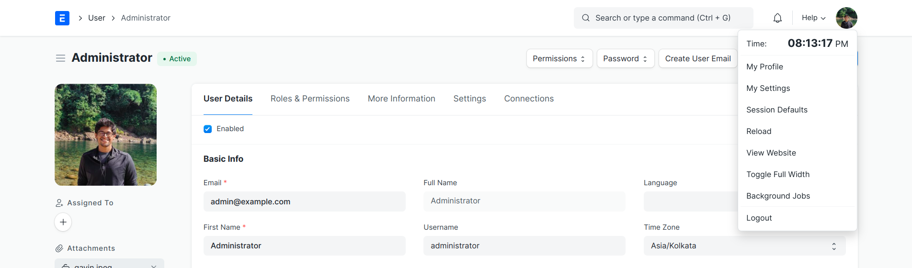
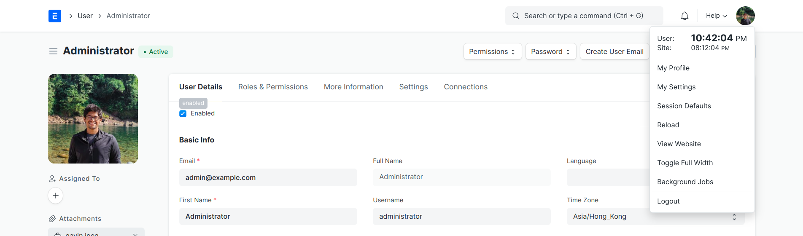
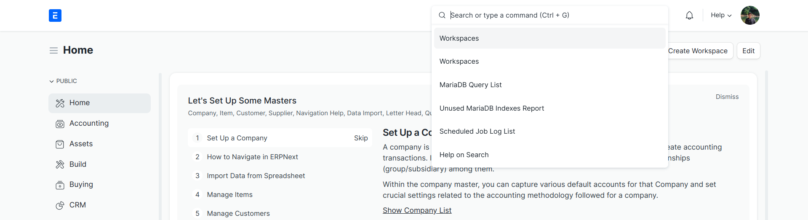
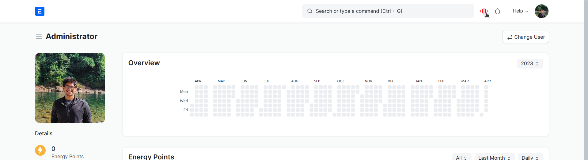

## Desk Navbar Extended

Tweaks in Desk's Navbar to boost Productivity

### Features

1. Show User & Site current time in Desk's Navbar Menu

*When User & Site TimeZones Match*

*When User & Site TimeZones are Different*

2. Wider Awesomebar

3. Voice Search in Awesomebar _[WIP]_

*Multi-language support powered by OpenAI*

#### License

MIT